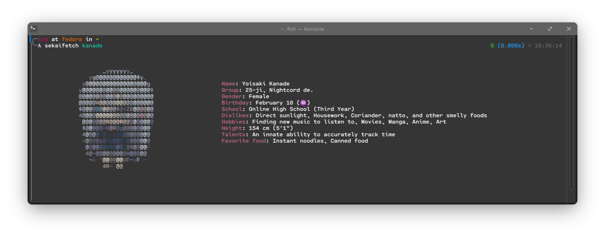

# sekaifetch
neofetch-like tool but for pjsk characters.<br>



inspired by [willowispill's vtubfetch](https://github.com/willowispll/vtubfetch)

## build

### linux

install 'python3 git binutils'

clone the repository 
```fish
git clone https://github.com/ivo9990/sekaifetch
```

inside the newly made sekaifetch folder 
```fish
cd sekaifetch
```
set up an virtual enviroment
```fish
python3 -m venv env
```

(if using fish shell do 'source env/bin/activate.fish')

install pyinstaller via pip
```fish
pip install pyinstaller
```
build
```fish
pyinstaller --onefile --add-data "ascii:ascii" sekaifetch.py'
```

binary is stored in 'dist'

### windows

to do

### macOS

🤔
